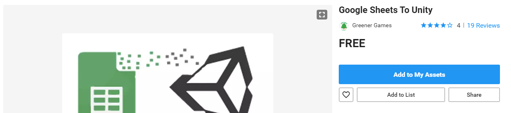

# Compliment Giver Documentation

Here is where I will document the creation of my Compliment Giver App.

In general, each section below will be comprised of various journal-like entries as I develop my app.

## Table of Contents

- [Introduction](#introduction)
	- [Project Proposal](#project-proposal)
	- [Project Proposal Feedback](#project-proposal-feedback)
	- [Gant Chart](#gant-chart)
- [Technical Process](#technical-process)
	- [Failures](#failures)
	- [A New Approach](#a-new-approach)
	- [Google Sheets to PHP](#google-sheets-to-php)
	- [PHP to Unity](#php-to-unity)
	- [Random Compliments](#random-compliments)
	- [Save System](#save-system)
- [Mid-semester Check-in](#mid-semester-check-in)
- [Art Process](#art-process)
- [User Guide](#user-guide)
- [Postmortem](#postmortem)


## Introduction

### Project Proposal

The first work I did for this project was to complete the assignment [_Project Proposal 1_](documentationFiles/projectProposal1.pdf) which was a first draft of my idea for the project I will create in this course (completed January 26th).
Below I will display my current answers to the various questions.

> ___What is your overall idea?___

> I want to make a small compliment-giving app using Unity.
I want to build an app that connects to a google sheet that someone else can fill with custom complements for the app user.
The ideal use of the app would be two users having the app and swapping URLs to separate google sheets and then filling each other’s sheets with compliments.

> ___What tool(s) do you hope to learn (or become more proficient at) over the course of this
project?___

> Unity 2D, C#, Photoshop, Adobe Illustrator

> ___How familiar are you with your chosen tools?___

> I’m familiar with Unity 3D, around 3 years of experience, but I have little to no experience Unity 2D.
C# I have a decent amount of experience, about 2 years, but I have never connected to an online source via C#.
I have about a year and a half of experience in Photoshop and Illustrator.

> ___How proficient do you expect to become via using your tools by the end of the semester?___

> Unity in general and especially Unity 2D can be quite complicated and more so can be learned best by trying out completely different projects.
With this app, I’m going out of my comfort zone so I can hopefully learn a new area of Unity.
I have done no online calls using C#, so I hope to become well-versed in this technique to use it on  later projects.
I can always be growing in Photoshop and Illustrator, especially in new and better methods/in their integration into Unity.

> ___What do you imagine your final project deliverable(s) will be based off the tool(s) you
use to create it?___

> The submission will be an app.
I will make an APK which can only be used by androids, so to let everyone experience the app I will also make a windows (standalone) build so you can use the app on your computer by just clicking the .exe, and a video taking you through the app to explain it.

> ___Do you think your stated final deliverable(s) are fair?___

> I think this is very fair. I am branching out into a space that I am not confident in
and don’t quite know how exactly to get it accomplished yet. Unity is notoriously
finicky and will take many hours of research and many tries to complete the main
mechanics of my app and that’s not including the art to make the app look better.

> ___Who is your target user group?___

> My target user group is rather broad. I think that couples within the 16-30 range
would enjoy the app the most as I intend it, which is almost gamifying love and
affection. I do think, however that some not in relationships may enjoy this app to
use with friends.

> ___Why are they your chosen target user group?___

> My main target group (16 – 30 and in a relationship) comes from the original 
concept of this app being used to better the communication between couples. I think
that in order to experience this app as it was intended the target group would need a
phone with the ability to use this app, the desire to use an app to communicate, and
a S.O. to communicate with via this app. Therefore, I think around 16 – 30 and in a
relationship is the user group that will best utilize this app

> ___What is your motivation for creating this project?___

> My motivation comes honestly from my semi-long-distance relationship and
wanting to still feel connected to my S.O. in a more personal way than just a random
compliment generator especially when either of us is busy.

> ___What is your purpose?___

> Good communication is a key to success in healthy relationship and ‘Words of
Affirmation’ is one of the most common languages of love/affection. With this app I
hope to give couples another avenue to express their love/affection and to receive
that love/affection when one or the other is busy or they just need a pick-me-up.

> ___What are your initial plans on how to tackle doing research for your project?___

> The hardest part of this project will be to get unity to pull, save, and then access .csv
files from google sheets so that’s where I will start. I plan on making a simple unity
scene that pulls a .csv from google sheets and displays the text in a UI text box. I
know that it is possible, so I have that going for me, I just need to find the right
tutorials and edit them for my specific purposes.

> ___What outcomes are you hoping for and/or foresee taking place?___

> Well I hope to get at least a beta out by Valentines’ Day to give to my S.O. to test out
but ultimately I hope to make at least an APK to post online so that my friends and 
anyone who wants to use the app can enjoy it and better their relationships or
friendships.

### Project Proposal Feedback

After completing my project proposal, I received and documented feedback from my peers. I will document it below:

I answered 5 questions for each peer. The questions were:

> 1) ___Can your classmate re-articulate back to you what your project is mainly about in 45 seconds to 1 minute?___
> 2) ___Do they think your project goals sound feasible?___
> 3) ___Do they think your multimedia tool goals sound feasible?___
> 4) ___Are there any multimedia tools they could suggest to you to help you in your project?___
> 5) ___What would they like to see you add, drop, and/or change about your project? Why?___

The responses were as follows:

<table>
<tr>
<td>
<b>Emilie Holtz</b>
</td>
<td>
	
1) Yes, she was accurate
			
2) Project sounds feasible

3) Multimedia tools sound feasible

4) No recommendations for multimedia tools

5) Add seasonal or changing content, keep UI fresh

</td>
</tr>

<tr>
<td>
<b>Logan Couch</b>
</td>
<td>
	
1) Yes, he understood the concept well enough to repeat it back

2) He thinks the project sounds achievable and not too small

3) He thinks the technologies used sound feasible

4) He didn’t have any recommendations for the multimedia tools

5) He recommended perhaps adding sound effects to make it more fun and game-like

</td>
</tr>
<tr>
<td>
<b>Diana Eakhshiyar</b>
</td>
<td>
	
1) She was a little confused about what’s being shared, it was my mistake as I emphasized too much on the documents and not on the app itself.

2) Goal sounds feasible

3) Tools sound feasible

4) No tools suggested

5) She suggested adding more art and making the app feel very loving

</td>
</tr>
</table>

I took their comments and used them to better shape my proposal and re-prioritize the way I would delegate my time for different parts of the project.

### Gant Chart

With the knowledge I gained from the creation of my project proposal and with the feedback I gained from my peers, I needed to create a schedule that I would try to follow in order to stay on track to complete my project in time.

To do this, I created a Gant Chart (template provided by my lab AI: Dinesh Ramaswamy) to attempt to manage my time.


As you can note in the chart above, I made a conscious decision to work on the technical aspects of my project first.
I did this because I wanted to be sure that I could get my core functions to work before spending time beautifying.
For this reason, I allotted up until week 9 (right before spring break) to get all technical aspects completed so that I can rest over spring break and polish when I get back.
I also saved a lot of time at the end of the semester for unforeseen setbacks and a lot of time for polishing so I did not run out of time.

Now with all pre-planning complete, I'm ready to start the production of my project.

## Technical Process

Here is where I will document the first half of the creation of this project: the technical process

### Failures

I started this process by trying to get my hardest mechanic out of the way: how to get information from google sheets into my app. The first thing that came to mind was to try different plugins from the [Unity Asset Store](https://assetstore.unity.com/) that would help me access the Google Sheets API. I wasted about 3 weeks trying these different methods, all of which failed.


My first plugin I attempted to use was [Google Sheets to Unity](https://assetstore.unity.com/packages/tools/utilities/google-sheets-to-unity-73410). This package was great for certain needs, but not for me. This package optimized the time spent with large groups by allowing information to be stored in google sheets then pulled into the Unity Editor. The problem for me, is that I need this plugin to work in real-time on people's apps, not just in the Unity Editor. So I had to scrap that Unity Project entirely to start over.


My second plugin I attempted was [XlsxParser](https://assetstore.unity.com/packages/tools/input-management/xlsxparser-80712) which was a plugin designed to parse through spreadsheets. This worked a little for me. I would download my google sheet as a spreadsheet then import it into unity, then use the package to read the sheet and display the different rows of compliments. My problem was that I needed this to work for any given google sheet and I couldn't figure out a way to get a spreadsheet download from any given google sheet so I gave up on this method too and scrapped this Unity project as well.


My third and final plugin I attempted to use was [MetaSheets Free](https://assetstore.unity.com/packages/tools/utilities/metasheets-free-94656) which I thought would assist in integrating the xlsx files into my project, and the plugin did work to an extent. The plugin would look at xlsx documents and help coding in visual studio by giving helpful code snippets and column names. Again, I ran into the issue that this only helped me if I could find a way to download xlsx documents and save them from google sheets.

### A New Approach

So none of the plugins that I was using worked out for me, so it was time to choose a new approach.
For my capstone project (my final project-based course for my Informatics degree) I needed to access a database while using Unity in real-time and I stumbled upon the use of calling a website with C#, writing that website in PHP to access a database and display certain needed information, then using C# to read and parse through that PHP page to use in-game.

This got me thinking about whether PHP can access Google Sheets and print out entries which, turns out, it can! This gave me the idea of how I would get my core functionality into my game.

I would write PHP code to parse through a given URL and display the columns.
I would then write C# code that would be able to construct a website URL to view, then parse through the content on that page and separate the content into individual compliments.

Now let's get into how I actually developed this functionality!


### Google Sheets to PHP

So I began by writing the PHP code that I would need to access Google Sheets, parse through a page, then display each of the entries separated by new lines.
I used this page -> [Google Sheets to PHP Tutorial](https://community.spiceworks.com/topic/1290489-use-google-spreadsheet-as-data-source-for-webpage) to understand the way that I properly access and parse through a Google Sheet and then edited the code slightly so that I would easily be able to parse through the lines inside of Unity.

Also required to make this work, I had to publish my example Google Sheet page and get the *.csv* share link.
This means that I will have to include some sort of setup instructions for the users so they know how to use the app.

Here's the first iteration of my PHP code (URL is hard-coded for testing):

```PHP
$spreadsheet_url="https://docs.google.com/spreadsheets/d/e/2PACX-1vSHvNJFikAJRxgf2V1Uf2yvMUHq56xKQjlIsVLBBM11gdE6-pKRy2ZpybwLyhn-Ew31bfnUraKdFOYi/pub?gid=0&single=true&output=csv";

if(!ini_set('default_socket_timeout', 15)) echo "<!-- unable to change socket timeout -->";

if (($handle = fopen($spreadsheet_url, "r")) !== FALSE) {
    while (($data = fgetcsv($handle, 1000, ",")) !== FALSE) {
		echo $data[0] . "\n";
    }
    fclose($handle);
}
else
    die("Problem reading csv");
```

### PHP to Unity

Now that I had a web-page that was accessing and displaying the entries from a Google Sheet, I could now use Unity's UnityWebRequest class to access and parse through that web-page.
This was the code that I was already familiar with through my work on my capstone project, but here is the original tutorial I used to learn this functionality -> [PHP to Unity Tutorial](https://wiki.unity3d.com/index.php/Server_Side_Highscores).

The code (written in C#) goes to a given URL (my PHP url), checks whether there's a connection issue, if there's not, will create an empty list of strings and fill it with each item in the downloaded text (if it's not empty).
This means that I now have all of the compliments from a given Google Sheet now saved as a list in Unity.

Here's the C# I used to download and save each compliment into a list:
```C#
 IEnumerator Display()
    {
        UnityWebRequest complimentsGet = UnityWebRequest.Get(url);
        yield return complimentsGet.SendWebRequest();

        if (complimentsGet.isNetworkError)
        {
            Debug.Log("Error: " + complimentsGet.error);
        }
        else
        {
            if (complimentsGet.downloadHandler.text == "")
            {
                Debug.Log("No Entries Found");
            }
            else
            {
                List<string> compliments = new List<string>();
                foreach (string st in complimentsGet.downloadHandler.text.Split('\n'))
                {
                    if (st != "")
                    {
                        compliments.Add(st);
                    }
                }
                this.GetComponent<ComplimentList>().compliments = compliments;
                this.GetComponent<ComplimentList>().SaveList();
            }
        }
    }
```

### Random Compliments

I then had to expand on this code in order to display each compliment randomly.
I started by just choosing a random item on each click of a button, but this meant that I got a lot of repeated compliments in a row and it took very long to get through the whole list.

To solve this, I made my own code that would ensure that we would iterate through the list of compliments randomly and we would not have repeats.
My solution was to create a new list, fill it with the compliments, then each time that the code was run, a random compliment from that new list would be used and deleted, then when that list became empty we would fill it once again with all compliments.
This means that all compliments will be seen before seeing repeats.

The code that I created to randomly choose compliments to display is shown below:

```C#
public class ComplimentList : MonoBehaviour
{
    public List<string> compliments = new List<string>();
    public List<string> UnusedCompliments = new List<string>();
    public GameObject ComplimentText;

    public void Display() {
        if (compliments.Count != 1) {
            if (UnusedCompliments.Count == 0) {
                UnusedCompliments = new List<string>(compliments);
            } 
            int nextCompliment = Random.Range(0, UnusedCompliments.Count);
            ComplimentText.GetComponent<TextMeshProUGUI>().text = UnusedCompliments[nextCompliment];
            UnusedCompliments.RemoveAt(nextCompliment);
        }
        
    }

    public void SaveList()
    {
        SaveSystem.SaveList(this);
        UnusedCompliments = new List<string>();
        Display();
    }

    public void LoadList()
    {
        ComplimentData data = SaveSystem.LoadList();

        if (!(data is null)) {
            compliments = data.compliments;
            Display();
        }
        
    }
}
```

### Save System

You may have noticed in the last code snippet that I included save/load functions.
This is because I wanted to be sure that users didn't have to re-download the Google Sheet they were using every time they opened the app.

To solve this problem, I integrated a save/load system that I became familiar with in my capstone project.
The original tutorial I used to learn how to save/load was this video by Brackeys -> [Unity Save/Load System](https://www.youtube.com/watch?v=XOjd_qU2Ido).

The two code snippets (below) take a list of strings, serialize the list (turn it into 1s and 0s) then save that file as "compliments.fun" into any device.
To load, the code takes that "compliments.fun" file, de-serialize it, then sets the list of complements to the list found in the saved file.

I also made it so that every time you grab data from a Google Sheet the system saves that list of compliments, and every time the program is started it tries to load an existing list of compliments.
This means that the compliments would be consistently found on every use of the app.

Here is my save/load code (written in C#):

```C#
[System.Serializable]
public class ComplimentData
{
    public List<string> compliments;

    public ComplimentData (ComplimentList list) {
        compliments = list.compliments;
    }
}
```
```C#
public static class SaveSystem
{

    public static void SaveList(ComplimentList list)
    {
        BinaryFormatter formatter = new BinaryFormatter();
        string path = Application.persistentDataPath + "/compliments.fun";
        FileStream stream = new FileStream(path, FileMode.Create);

        ComplimentData data = new ComplimentData(list);

        formatter.Serialize(stream, data);
        stream.Close();
    }

    public static ComplimentData LoadList()
    {
        string path = Application.persistentDataPath + "/compliments.fun";
        if (File.Exists(path))
        {
            BinaryFormatter formatter = new BinaryFormatter();
            FileStream stream = new FileStream(path, FileMode.Open);

            ComplimentData data = formatter.Deserialize(stream) as ComplimentData;

            stream.Close();

            return data;
        }
        else
        {
            Debug.Log("Save file not found in " + path);
            return null;
        }
    }

}
```
## Mid-semester Check-in

On February 26th we had a PowerPoint explaining where we were due to show our peers and get input about our current accomplishments and where to go from here.
You can find the presentation link here -> [Compliment App Check In PowerPoint](documentationFiles/ComplimentAppCheckIn.pptx)

I thought now would be a good time in my documentation to also do a quick summary of where I stand.

I now have all my functionality built into my app that I'll need, the only remaining tasks are to beautify my UI.

Here you can see compliments being displayed, you can place in a new Sheet URL, refresh your compliments, and get a new random compliment:


Here is what my example Google Sheet looks like, all compliments are just listed down the first column:


And here is what the inspector looks like inside of Unity.
Notice that each compliment is it's own item.
Also notice that I have two lists, one to store the compliments, one to choose from:


## Art Process

## User Guide

## Postmortem

## Sources

- [Google Sheets to PHP Tutorial](https://community.spiceworks.com/topic/1290489-use-google-spreadsheet-as-data-source-for-webpage)
- [PHP to Unity Tutorial](https://wiki.unity3d.com/index.php/Server_Side_Highscores)
- [Unity Save/Load System](https://www.youtube.com/watch?v=XOjd_qU2Ido)
